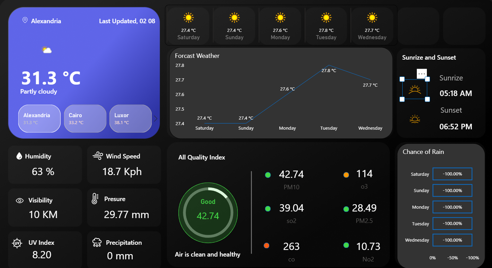

# 🌦️ Weather Analytics Dashboard | Power BI

## 📌 Project Overview

This project presents an interactive Weather Analytics Dashboard built with Power BI. It provides a comprehensive overview of weather conditions using dynamic KPIs, trend analysis, and interactive visualizations to help users monitor and analyze weather data across different locations and dates.

---

## 🎯 Project Objectives

* Monitor key weather metrics in one dashboard.
* Analyze temperature trends over time.
* Compare weather conditions across different locations.
* Track humidity, rainfall, wind speed, visibility, and UV Index.
* Enable interactive filtering for deeper analysis.

---

## 📊 Dashboard Features

### KPI Cards

* 🌡️ Average Temperature
* 💧 Average Humidity
* 🌧️ Total Rainfall
* 💨 Average Wind Speed
* 👀 Average Visibility
* ☀️ Average UV Index

### Visualizations

* Temperature Trend Over Time (Line Chart)
* Weather Conditions Distribution
* Rainfall Analysis
* Humidity Comparison
* Wind Speed Analysis
* Sunrise & Sunset Information
* Location-Based Weather Comparison

### Interactive Filters

* Date
* Location
* Weather Condition

---

## 🛠️ Tools & Technologies

* Microsoft Power BI
* Power Query
* DAX
* Data Modeling

---

## 📈 Key Insights

* Identify temperature fluctuations over time.
* Compare weather metrics between different locations.
* Analyze rainfall patterns.
* Monitor humidity and wind speed trends.
* Track visibility and UV Index levels.
* Explore weather conditions using interactive filters.

---

## 📸 Dashboard Preview

---

## 🚀 Skills Demonstrated

* Data Cleaning
* Data Transformation
* Data Modeling
* DAX Measures
* Interactive Dashboard Design
* KPI Development
* Data Visualization
* Business Intelligence Reporting

---

## 👩‍💻 Author

**Raneem Sameh**

---

⭐ If you found this project interesting, feel free to star the repository and connect with me!
